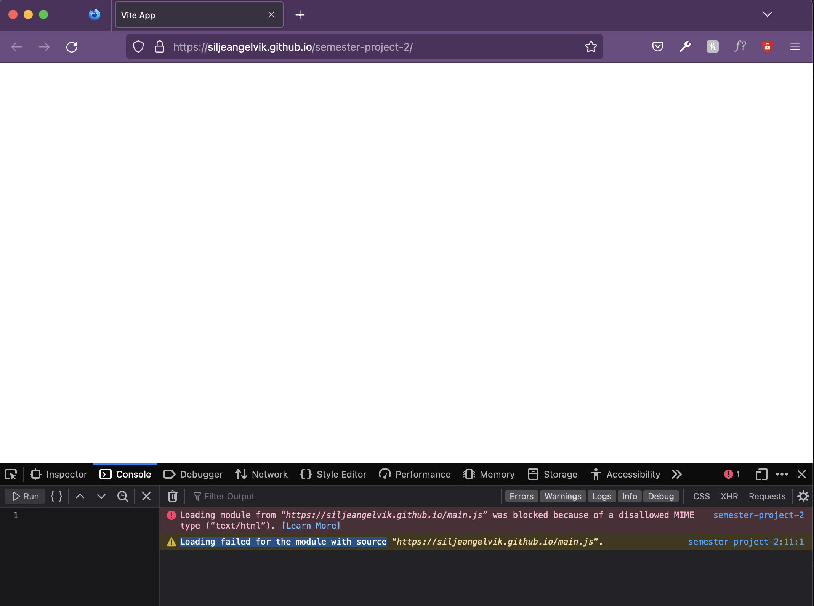
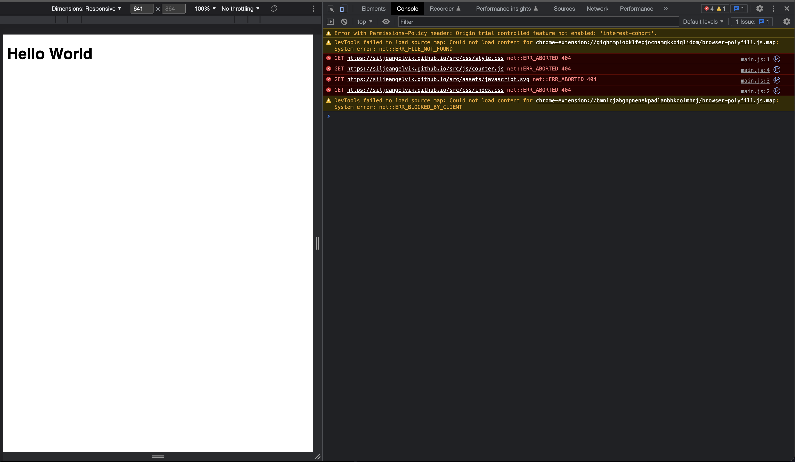

# Reminder Notes

### add to package.json - scripts:  
"build:lib": "vite build --config build/vite.config.lib.js"

## errors & warnings  

### MIME-type (ONLY on GitHub Pages, Netlify Demo is working fine.)
**Error:**  
Loading module from “https://siljeangelvik.github.io/main.js” was blocked because of a disallowed MIME type (“text/html”).  
**Warning:**  
Loading failed for the module with source “https://siljeangelvik.github.io/main.js”.  
    
_are SVG compatible with HTML5?_  HTML4 is obviously [very compatible](https://www.w3.org/TR/2000/CR-SVG-20000802/CR-SVG-20000802.pdf), no info on HTML5  

In **Chrome** I get the same, maybe slightly more information?  
  

Error in Web Console:  
https://github.blog/changelog/2021-04-27-github-pages-permissions-policy-interest-cohort-header-added-to-all-pages-sites/    
[Mozilla HTTP Observatory Test](https://observatory.mozilla.org/analyze/siljeangelvik.github.io)  

---

## git
### create a new branch
creating a new **feature-branch**:    
`$ git checkout -b <feature-branch>`  

### merge branch
go to the branch you want to **merge** with:  
`$ git checkout main`    
check **status** of current **branch**:   
`$ git status`  
merge **feature-branch** into **main** branch:  
`$ git merge <feature-branch>`  

_**note:** want to make an `onMerge` workflow_  

### push local branch to remote branch
standing in the branch you want to **push** to remote:    
`$ git push -u origin <remote-branch>`    

_**note:** I want `onPush` workflow to deploy to the hosting service_      

### delete local and remote branch
remove a **local branch:**    
`$ git branch -d <local-branch>`    

remove a **remote branch:**    
`$ git push origin -d <remote-branch>`